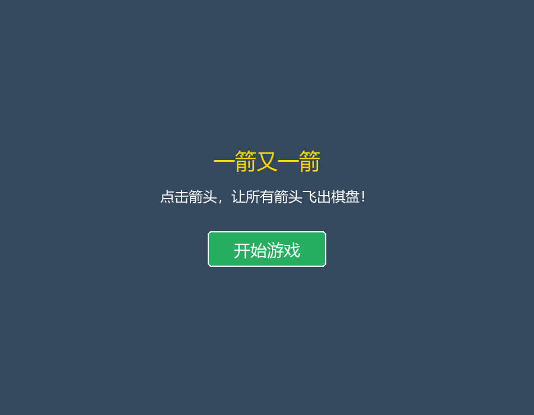
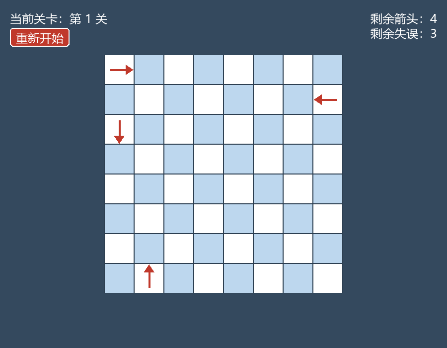
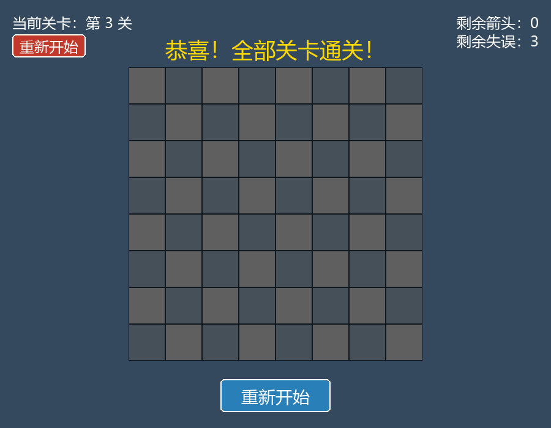

# 一箭又一箭

## 一、项目简介

「一箭又一箭」是一款基于 Python + Pygame 开发的点击式箭头解谜小游戏。

玩家通过点击棋盘上的箭头来推进游戏：

- 如果箭头沿自身指向方向到棋盘边缘的路径上**没有其他箭头阻挡**，则箭头可以飞出棋盘；
- 如果路径上**存在其他箭头**，被点击的箭头会向前移动、与障碍物发生碰撞并原路返回，同时消耗一次失误次数。

玩家需要规划点击顺序，依次清除棋盘上的所有箭头。

本项目是一个小型休闲解谜游戏，同时也是软件工程课程实践项目。

## 二、游戏特点

1. 8×8 棋盘
2. 支持上、下、左、右四个方向的箭头
3. 鼠标点击操作
4. 自动判断箭头是否可以沿自身方向飞出棋盘
5. 三个固定关卡，均经过可解性验证（`is_level_solvable()`），保证不存在死锁
6. 箭头成功点击后执行飞出棋盘的动画
7. 被阻挡的箭头执行「向障碍物移动 → 碰撞震动 → 原路返回」的动画
8. 返回过程中箭头本身的朝向始终保持不变
9. 每关具有失误次数限制（最多 3 次）
10. 具有开始界面、关卡切换、通关、失败和重新开始的完整游戏流程

## 三、游戏规则

- 点击棋盘上的箭头后，游戏会检查该箭头前进路径上是否存在其他箭头。
- **没有障碍物**：箭头沿自身方向飞出棋盘并被清除。
- **有障碍物**：箭头向障碍物移动，发生碰撞震动后原路返回，并消耗一次失误次数。
- 失误次数耗尽后，游戏失败。
- 当前关卡所有箭头都被清除后，进入下一关。
- 三个关卡全部完成后，游戏通关。
- 游戏过程中可以随时通过「重新开始」按钮重新进行游戏。

## 四、操作方式

| 操作 | 功能 |
|---|---|
| 鼠标左键 | 点击棋盘上的箭头 |
| 开始游戏按钮 | 从开始界面进入第 1 关 |
| 下一关按钮 | 单关通关后进入下一关 |
| 重新开始按钮 | 回到第 1 关重新开始 |

## 五、游戏界面

游戏开始界面：



游戏进行界面：



游戏结果界面（通关 / 失败）：



## 六、项目结构

```
one-arrow-after-another/
├── main.py          # 游戏主程序（包含全部游戏逻辑与界面绘制）
├── images/          # README 使用的游戏界面截图
│   ├── start.png
│   ├── game.png
│   └── result.png
├── AIGC记录.md       # AIGC 工具使用过程记录
├── .gitignore       # Git 忽略文件配置
└── README.md        # 项目说明文档
```

说明：

- `main.py`：游戏主要程序，包含窗口、棋盘、关卡数据、路径检测、动画、状态管理等全部代码。
- `images/`：README 中使用的游戏界面截图。
- `AIGC记录.md`：课程要求的 AIGC 使用过程记录。
- `.gitignore`：Git 忽略文件配置。
- 本地 Python 虚拟环境（`.venv`）和 `__pycache__` 已通过 `.gitignore` 忽略，不属于项目代码。

## 七、运行环境

- 操作系统：Windows
- Python：3.12
- Pygame：2.6.1

### 安装依赖

```bash
pip install pygame==2.6.1
```

### 运行游戏

```bash
python main.py
```

## 八、核心实现

游戏的全部逻辑集中在 `main.py` 中，下面按模块简要说明实现思路。

### 1. 棋盘与箭头数据结构

- 棋盘使用一个 8×8 的二维列表 `BOARD` 表示。
- 空格用空字符串 `""` 表示，有箭头的格子用方向字符串 `"up"` / `"down"` / `"left"` / `"right"` 表示。
- 关卡数据 `LEVEL_1`、`LEVEL_2`、`LEVEL_3` 以常量形式定义，并统一放入 `LEVELS` 列表。
- 进入关卡时通过 `load_level()` 使用 `copy.deepcopy()` 复制关卡数据，避免游戏过程中修改原始关卡。

### 2. 四个方向的表示

使用字典 `DIRECTIONS` 把方向映射为单位向量 `(水平分量, 垂直分量)`：

```python
DIRECTIONS = {
    "up": (0, -1),
    "down": (0, 1),
    "left": (-1, 0),
    "right": (1, 0),
}
```

由于屏幕坐标中 y 轴向下为正，所以向上对应 `-1`。箭头绘制、飞出移动和碰撞移动都复用这一方向向量。

### 3. 鼠标点击与坐标转换

函数 `get_clicked_cell()` 根据鼠标像素坐标和棋盘左上角位置，换算出所在的行、列：

```text
col = (鼠标x - 棋盘x) // 格子边长
row = (鼠标y - 棋盘y) // 格子边长
```

如果点击不在棋盘范围内则返回 `None`。按钮点击则通过矩形包含判断 `is_click_in_rect()` 处理。

### 4. 箭头飞出路径检测

- `can_arrow_exit(row, col)` 用于判断当前 `BOARD` 中某箭头能否飞出。
- 核心逻辑在 `can_arrow_exit_on_board(board, row, col)` 中，它接收一个棋盘参数，因此既可以判断真实棋盘，也可以在棋盘副本上做模拟。
- 判断方式：从箭头相邻格子开始，沿其方向逐格检查到边界，只要发现任意其他箭头就返回 `False`（被阻挡），否则返回 `True`（可以飞出）。

### 5. 箭头飞出动画

- 可以飞出的箭头会被加入 `flying_arrows` 列表，列表中记录箭头的行列、方向、当前像素坐标和速度。
- 主循环每一帧按方向更新坐标，并在棋盘上方重新绘制。
- 当箭头完全离开棋盘区域（`is_flying_arrow_off_board()` 判断）后，才把 `BOARD` 中对应格子置空。
- 飞出的箭头不从 `BOARD` 立即删除，从而避免动画刚开始时箭头“瞬间消失”。

### 6. 被阻挡箭头的碰撞动画

被阻挡时使用单个字典 `blocked_arrow_animation` 记录动画状态，分为三个阶段：

1. `moving_forward`：箭头沿自身方向移动到第一个障碍箭头前的安全距离处；
2. `collision`：短暂停顿并震动（使用 `sin` 函数生成震动偏移，障碍箭头同时产生轻微反向震动）；
3. `moving_back`：沿来时路径反向移动，精确回到原始格子。

动画期间箭头的 `direction` 始终不变，因此“移动方向”和“箭头朝向”是两个独立的概念：返回时箭头虽然在反向移动，图形仍保持原方向。障碍箭头的位置只在绘制时临时偏移，不会修改 `BOARD`。

### 7. 失误次数管理

- 常量 `MAX_MISTAKES = 3`，变量 `mistakes_left` 记录当前剩余失误次数。
- 每次进入新关卡时通过 `load_level()` 将失误次数重置为 3。
- 点击被阻挡箭头时扣除一次，并且只在点击瞬间扣除，动画过程中不会重复扣除。
- 当失误次数降为 0 时，使用 `pending_game_over` 标记延迟状态切换：等当前碰撞返回动画完整结束后，才进入游戏失败界面。

### 8. 游戏状态管理

使用字符串变量 `game_state` 表示游戏状态机：

| 状态 | 含义 |
|---|---|
| `start` | 开始界面，等待点击「开始游戏」 |
| `playing` | 游戏进行中，可点击棋盘 |
| `level_complete` | 当前关卡通关，等待点击「下一关」 |
| `game_complete` | 三关全部通关，等待点击「重新开始」 |
| `game_over` | 失误次数耗尽，等待点击「重新开始」 |

主循环根据当前状态分别处理鼠标事件和界面绘制，不同状态下只响应对应的操作。

### 9. 固定关卡与可解性验证

- 三个关卡均为手工设计的固定关卡，不使用随机生成。
- `is_level_solvable(level)` 在关卡副本上模拟玩家操作：每一轮找出当前所有可以飞出的箭头并消除一个，循环直到棋盘清空或陷入无解；函数返回是否可解以及一种可行的通关顺序。
- `verify_levels()` 会在程序启动时对三个关卡进行验证，并把结果输出到控制台，仅用于开发和测试阶段，不影响游戏界面。

## 九、关卡设计

游戏目前包含 3 个固定关卡，每个关卡都是 8×8 棋盘。关卡的核心是让玩家按照正确的顺序清除箭头：有些箭头一开始被其他箭头挡住，必须先清除前方的箭头，后面的箭头才能飞出。

- **第 1 关（热身关）**：共 4 个箭头，分别位于第 1 行最左侧（向右）、第 2 行最右侧（向左）、第 3 行最左侧（向下）和最后一行（向上），箭头之间互不阻挡，用于熟悉基本操作。
- **第 2 关（简单依赖）**：共 5 个箭头。同一行上有两个朝右的箭头，靠后的箭头被靠前的箭头挡住，需要先清除靠前的箭头后，后面的箭头才能飞出。
- **第 3 关（链式依赖）**：共 6 个箭头。同一列上有三个朝下的箭头依次排列，必须从最下方的箭头开始，按从下到上的顺序逐个清除，形成一条明确的依赖链。

三个关卡都经过 `is_level_solvable()` 验证，保证存在通关顺序、不会死锁。当前关卡所有箭头都被清除后进入下一关；三关全部完成后游戏通关。

## 十、游戏流程

游戏整体流程如下：

```text
开始界面
    ↓
点击「开始游戏」
    ↓
第 1 关
    ↓
点击箭头 → 判断前进路径是否畅通
    ├─ 可以飞出 → 飞出动画 → 箭头从棋盘清除
    └─ 被阻挡   → 前进碰撞 → 震动 → 原路返回 → 失误次数 -1
    ↓
当前关卡箭头全部清除 → 点击「下一关」→ 第 2 关 → 第 3 关
    ↓
三关全部完成 → 游戏通关 → 可点击「重新开始」
```

补充说明：

- 失误次数耗尽后，会先播完当前碰撞返回动画，再进入游戏失败界面。
- 无论游戏通关还是失败，都可以通过「重新开始」按钮回到第 1 关；游戏进行中左上角也提供了随时可用的「重新开始」按钮。

## 十一、项目运行说明

以 Windows 环境为例，从获取项目到运行游戏的步骤如下。

1. 克隆或下载项目后，进入项目目录：

```bash
cd one-arrow-after-another
```

2. 创建并激活 Python 虚拟环境（可选，推荐）：

```bash
python -m venv .venv
.venv\Scripts\activate
```

3. 安装依赖：

```bash
pip install pygame==2.6.1
```

4. 运行游戏：

```bash
python main.py
```

## 十二、项目文件说明

| 文件 / 目录 | 作用 |
|---|---|
| `main.py` | 游戏主要程序，包含窗口、棋盘、关卡、路径检测、动画与状态管理等全部逻辑 |
| `README.md` | 项目说明文档 |
| `AIGC记录.md` | 课程要求的 AIGC 工具使用过程记录 |
| `.gitignore` | Git 忽略文件配置，已忽略 `.venv/`、`__pycache__/` 和 `*.pyc` |
| `images/` | README 中使用的游戏界面截图（`start.png`、`game.png`、`result.png`） |

## 十三、项目特色与收获

通过本项目的开发，主要实践了以下内容：

- 使用 Python + Pygame 完成窗口创建、图形绘制和游戏主循环；
- 处理鼠标事件，并完成屏幕像素坐标到棋盘行列坐标的转换；
- 使用状态机管理开始、游戏中、关卡通关、全部通关和游戏失败等多种游戏状态；
- 实现基于路径扫描的阻挡判断，以及箭头与障碍之间的碰撞反馈；
- 使用逐帧更新位置的方式实现飞出动画和“前进—碰撞—返回”动画；
- 设计固定关卡，并通过 `is_level_solvable()` 在副本上模拟验证关卡可解性；
- 在开发过程中使用 TRAE 等 AIGC 工具辅助设计、排查问题和整理文档。

整体规模较小，但覆盖了一个完整小游戏从规则设计、关卡验证到界面交互的基本流程。

## 十四、后续改进方向

以下功能目前**尚未实现**，属于后续可以考虑的改进方向：

- 增加更多关卡，或提高关卡难度；
- 增加关卡编辑器，支持自定义箭头布局；
- 增加音效和背景音乐；
- 增加更丰富的动画和视觉反馈效果；
- 进一步优化界面视觉设计；
- 增加通关计时、点击步数等统计信息。

## 十五、AIGC 协作说明

本项目在开发过程中使用了 TRAE + ChatGPT 等 AIGC 工具辅助开发，AI 主要用于：

- 代码结构设计与功能实现辅助；
- 运行中出现的 Bug 分析与修复建议；
- 关卡可解性验证（`is_level_solvable()`）的方案设计；
- README 等项目文档的整理与润色。

需要说明的是，AI 提供的是辅助建议，所有代码均经过人工理解、运行测试和修改确认，项目功能以实际代码和运行结果为准。
